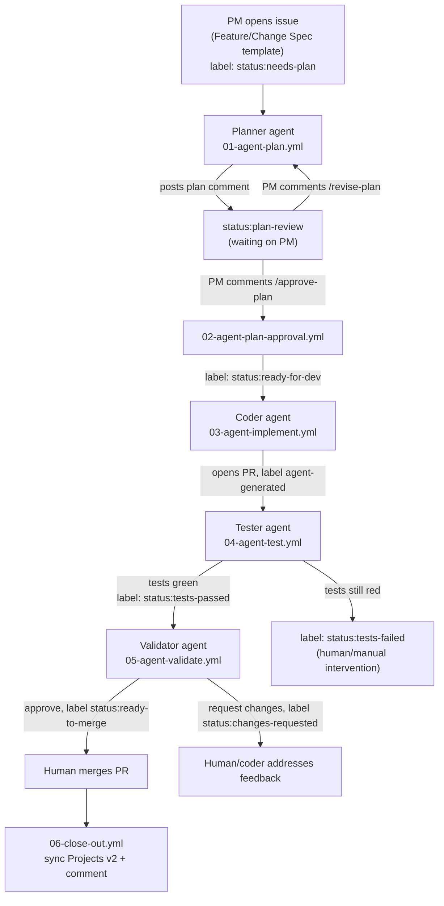

# Spec-Driven Multi-Agent Pipeline

A PM files a spec as a GitHub Issue. From there, everything happens on GitHub —
no one needs to open Claude Code. Five agents (Planner, Coder, Tester,
Validator, plus a deterministic close-out step) run as GitHub Actions jobs,
handing off to each other through issue/PR labels and comments, with one
human approval gate in the middle.

## Repo layout: hub + consumer repos

This repo is the **hub** — `.github/workflows/*.yml` here are reusable
workflows (`workflow_call`), not directly triggered by anything in this repo.
Every repo that should actually run the pipeline (a **consumer repo**, e.g.
your existing product repos) gets a copy of `templates/consumer-repo/`: thin
~10-line caller workflows that hold the real `on:` triggers and just
`uses:` the corresponding workflow here. One place to update prompts/logic,
many repos pick it up automatically.

**Full setup and token-generation steps are in [SETUP.md](SETUP.md).**
Short version:

1. Push this repo, wire up org-level secrets (`ANTHROPIC_API_KEY`,
   `GH_AUTOMATION_TOKEN`), install the Claude GitHub App.
2. For each existing repo you're onboarding: copy `templates/consumer-repo/`
   in, fill in its `.claude/pipeline.config.yml` with real build/test
   commands, run the "Setup Labels" workflow once, do a dry-run issue.

## Why a separate automation token

GitHub Actions has an anti-recursion rule: **actions performed with the
default `GITHUB_TOKEN` do not trigger other workflow runs.** If the Planner's
label change or the Coder's PR were made with `GITHUB_TOKEN`, the next stage
would simply never fire — no error, the pipeline just silently stalls. Every
step that needs to hand off to another workflow (adding a label, opening a
PR) uses `GH_AUTOMATION_TOKEN` instead. Steps that don't need to trigger
anything further (posting a comment for a human to read) can and do use the
default token.

## The state machine (labels)

| Label | Meaning | Set by |
|---|---|---|
| `status:needs-plan` | New spec, plan not started | Issue template default |
| `status:plan-review` | Plan posted, waiting on PM | Planner agent |
| `status:ready-for-dev` | Plan approved | Approval gate |
| `status:in-review` | PR open, moving through test/validate | Coder agent |
| `status:tests-failed` | Tester couldn't get to green | Tester agent |
| `status:tests-passed` | Tests green, awaiting validation | Tester agent |
| `status:ready-to-merge` | Validator approved | Validator agent |
| `status:changes-requested` | Validator found problems | Validator agent |
| `agent-generated` | Marks bot-authored branches/PRs | Coder agent |

## Commands the PM/reviewers use

- `/approve-plan` (comment on the issue) — unblocks the Coder agent.
- `/revise-plan <what's wrong>` (comment on the issue, while in
  `status:plan-review`) — sends it back to the Planner with your feedback.

## Adding more agents

Each stage is just another `anthropics/claude-code-action@v1` job gated by an
`if:` on a label, with its own `prompt`. To insert a new stage (e.g. a
**security-review** agent between Test and Validate, or a **docs** agent that
updates the README/changelog after merge):

1. Pick the label that should trigger it and the label it hands off to.
2. Add a new `NN-agent-<name>.yml` here in the hub, copying the shape of
   `05-agent-validate.yml` (`on: workflow_call`, checkout, one
   `claude-code-action` step, a prompt that tells it how to find context —
   linked issue, plan comment, diff — and what label/comment to leave).
3. Add the matching thin caller to `templates/consumer-repo/.github/workflows/`.
4. Remember the automation-token rule above if it needs to trigger anything
   downstream, then re-copy just that one caller file into repos you want it
   active in (existing consumer repos otherwise keep working unchanged, since
   the hub is additive).

## Known limitations / things left as manual steps by design

- **The "changes requested" loop isn't auto-wired back to the Coder agent.**
  A human (or a `/agent-fix` comment you wire up yourself, mirroring
  `02-agent-plan-approval.yml`) currently decides whether to re-run the
  Coder. Kept manual here rather than building an unbounded fix-retry loop.
- **Merging is always a human action** (per current design) — the Validator
  agent approves the PR review but does not merge it.
- Cost/runaway control is via `--max-turns` on each `claude_args` block —
  tune per stage.
